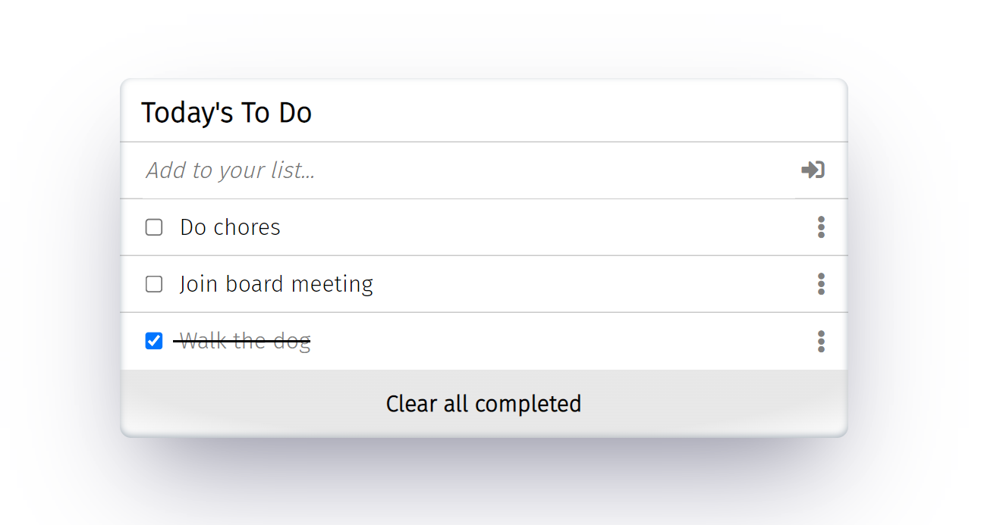

# TODO List

>"To-do list" is a tool that helps to organize your day. It simply lists the things that you need to do and allows you to mark them as complete..

## Built With

- HTML & CSS
- JavaScript
- Webpacks

## Live Demo

[Live Demo Link](https://shadyshawkat.github.io/TODO-List/dist)
## Getting Started

To get a local copy up and running follow these simple example steps.

1- Navigate to the button on the top right green "code" button.
2- In the drop down menu choose "Download Zip".
3- After extracting the files, you'll have my project on your local machine.

## Authors

👤 **Shady Shawkat**

- GitHub: [@shadyshawkat](https://github.com/ShadyShawkat)
- Twitter: [@shadyshawkat](https://twitter.com/ShadyShawkat3)
- LinkedIn: [shadyshawkat](https://www.linkedin.com/in/shady-shawkat/)

## 🤝 Contributing

Contributions, issues, and feature requests are welcome!

Feel free to check the [issues page](../../issues/).

## Show your support

Give a ⭐️ if you like this project!

## 📝 License

This project is [MIT](./MIT.md) licensed.
